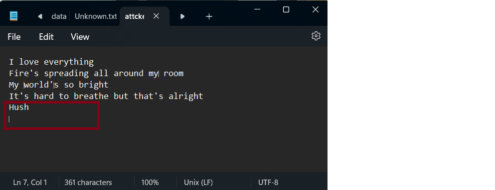
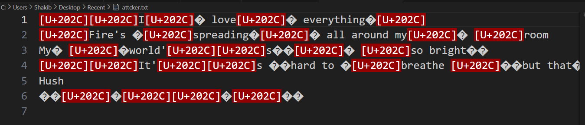
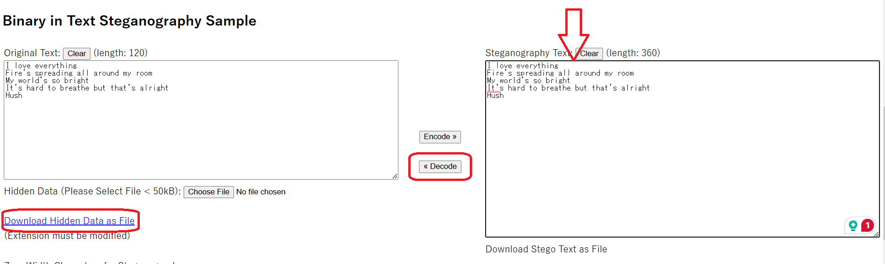

# Attacter's file

**Challenge Description: Recently, we intercepted an attacker's computer that contained two files. These files look suspicious, and the attacker may have hidden some information within them. Are you skilled enough to extract the hidden data?**

Difficulty: Easy
Flag Format: JKKNIUCTF{some_text}
Author: TM_47

---

- **There are two files. One is an image file, and another is a text file.**
- **Open the text file, and it looks suspicious. See**
  
  

- **Let's open it in VS Code.**

  

- **See, I told you there is something weird.**
- **Use this tool to solve it.**
  **[Zero-Width Characters](https://330k.github.io/misc_tools/unicode_steganography.html)**
  
- **Paste the text, decode it, and download the hidden data as a file.**

- **Open the file. You got it.**

---

# Flag:

    JKKNIUCTF{catch_me_if_you_can}