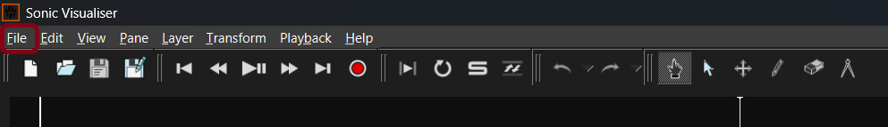
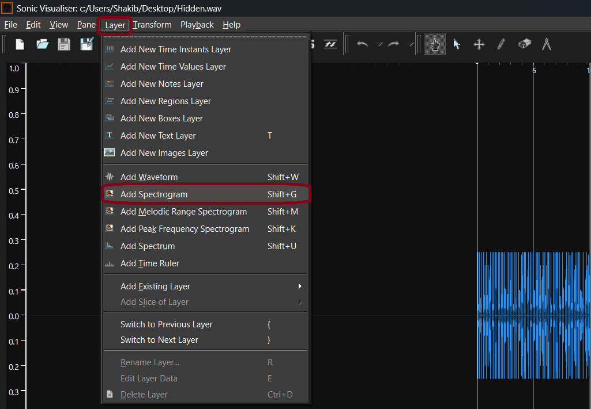
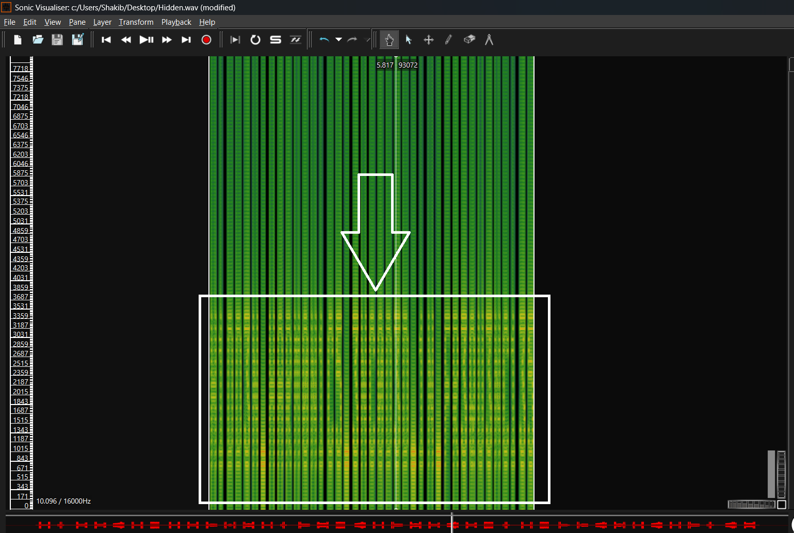

# WavStego

**Challenge Description: Find out the hidden message**

Difficulty: Easy
Flag Format: JKKNIUCTF{H1DD3N_M3SS4G3}
Author: TM_47

---

- **Let's try sonic Visualizer**
- **If don't have it, [download and install](https://www.sonicvisualiser.org/download.html)**
- **Open it and upload the file**
  

- **From _Layer_ select _Add Spectrogram_**
  

- **Did you see something! Zoom it and get the flag.**
  
